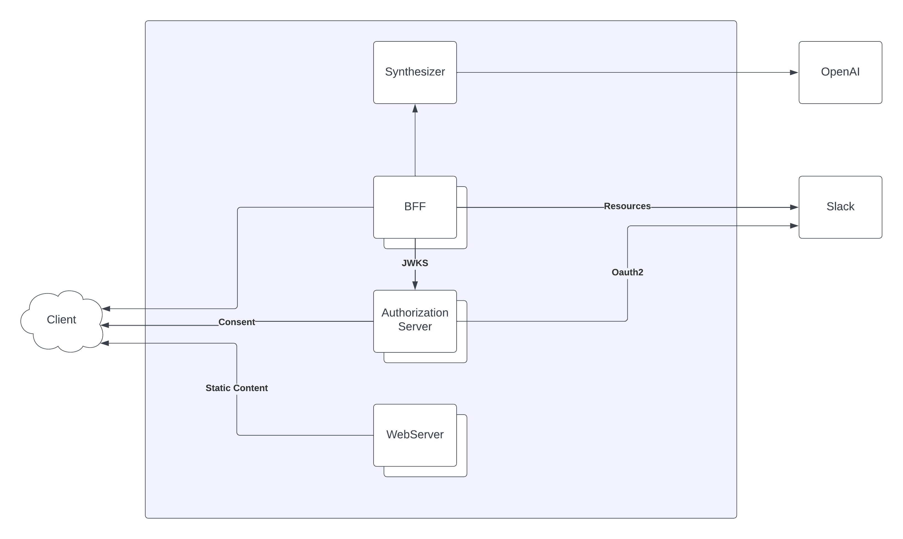

# FAST-RESUME

The scope of the project is to integrate with Slack in order to summarize the content from different channels. The summarization process will be performed by leveraging the artificial intelligence functionality exposed by OpenAI.

## Components

### WebServer

Responsible for serving static content. Code splitting was implemented to serve static files on demand, and etag handling was implemented to encourage browser caching. This server is written in Go, and the static files are embedded in the binary resulting from the compilation.

### Authorization Server

It is responsible for managing the oauth2 flow with Slack. It digitally signs the generated tokens asymmetrically using RSA256 and exposes a signature verification endpoint in JWKS format. Furthermore, it provides instructions to the client on securely storing the JWT (JSON Web Token).

### BFF

It caters to the specific needs of the client regarding the acquisition of Slack resources. It validates tokens using the endpoint provided by the authorization server. Additionally, it manages caching of Slack resources and consumes the synthesizer server to summarize texts using the API exposed by OpenAI.

### Synthesizer

It exposes the functionality of text summarization using the OpenAI API. Furthermore, it caches the results by employing a hashing function on the texts to generate the cache key.